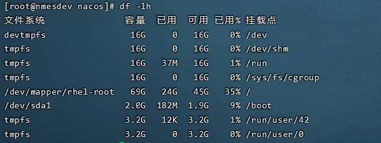
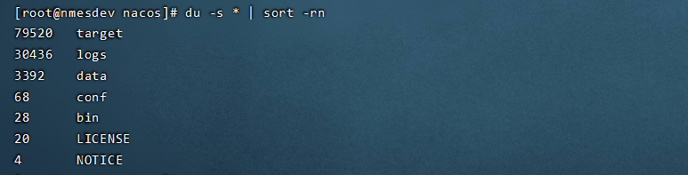

### 1、df -lh

> df是“disk free”的缩写，用于显示Linux系统中各文件系统的硬盘使用情况，包括文件系统所在硬盘分区的总容量、已使用的容量、剩余容量等；语法为“df [选项] [目录或文件名]”，若省略全部参数，默认显示系统内所有的文件系统信息。

```sh
df -lh
```



### 2、du

```
du`命令用来查看目录或文件所占用磁盘空间的大小。常用选项组合为：`du -sh
```

`a`表示显示目录下所有的文件和文件夹（不含子目录），`h`表示以人类能看懂的方式，`max-depth`表示目录的深度，

`-s`或–summarize 仅显示总计，即当前文件夹的大小。

```sh
du -ah --max-depth=1
du -h –-max-depth=0 user
du -sh –-max-depth=2 | more
```

### 3、查询当前目录的文件夹及文件大小以(byte)单位显示并升序排序

```sh
du -s * | sort -rn
```



### 4、查询当前目录的文件夹及文件大小以(KB、MB、GB、TB)等人类可读单位显示并升序排序

```sh
du -sh * | sort -rn
```

### 5、查询指定目录的文件夹及文件大小以(byte)单位显示并升序排序

```sh
du -s /u01/home/localFile/* | sort -rn
```

### 6、查询指定目录的文件夹及文件大小以(KB、MB、GB、TB)等人类可读单位显示并升序排序

```sh
du -sh /u01/home/localFile/* | sort -rn
```

### 7、选出排在前面的10个

```sh
du -s /u01/home/localFile/* | sort -rn | head
```

### 8、选出排在后面的10个

```sh
du -s /u01/home/localFile/* | sort -rn | tail
```

### 9、du常用的选项：

语　　法：

```sh
du [-abcDhHklmsSx] [-L <符号连接>][-X <文件>][--block-size][--exclude=<文件夹或文件>] [--max-depth=<文件夹层数>][--help][--version][文件夹或文件]
```

-h：以人类可读的方式显示

-a：显示目录占用的磁盘空间大小，还要显示其下目录和文件占用磁盘空间的大小

-s：显示目录占用的磁盘空间大小，不要显示其下子目录和文件占用的磁盘空间大小

-c：显示几个目录或文件占用的磁盘空间大小，还要统计它们的总和

--apparent-size：显示目录或文件自身的大小

-l ：统计硬链接占用磁盘空间的大小

-L：统计符号链接所指向的文件占用的磁盘空间大小

常使用參数：
`-a`或`-all` 为每一个指定文件显示磁盘使用情况，或者为文件夹中每一个文件显示各自磁盘使用情况。

`-b`或`-bytes` 显示文件夹或文件大小时，以byte为单位。

`-c`或`–total` 除了显示文件夹或文件的大小外，同一时候也显示全部文件夹或文件的总和。

`-D`或`–dereference` `-args` 显示指定符号连接的源文件大小。

`-h`或`–human` `-readable` 以`K``，M``，G`为单位，提高信息的可读性。

`-H`或`–si` 与`-h`參数同样，可`是K``，M``，G`是以`1000`为换算单位,而不是以`1024`为换算单位。

`-k`或`–kilobytes` `以1024`` bytes`为单位。

`-l`或`–count` `-links` 反复计算硬件连接的文件。

`-L`<符号连接>或`–dereference`<符号连接> 显示选项中所指定符号连接的源文件大小。

`-m`或`–megabytes` 以`1MB`为单位。

`-s`或`–summarize` 仅显示总计，即当前文件夹的大小。

`-S`或`–separate` `-dirs` 显示每一个文件夹的大小时，并不含其子文件夹的大小。

`-x`或`–one``-file` `-xystem` 以一開始处理时的文件系统为准，若遇上其它不同的文件系统文件夹则略过。

`-X`<文件>或`–exclude` `-from`=<文件> 在<文件>指定文件夹或文件。

`–exclude`=<文件夹或文件> 略过指定的文件夹或文件。

`–max` `-depth`=<文件夹层数> 超过指定层数的文件夹后，予以忽略。

`–help` 显示帮助。

`–version` 显示版本号信息