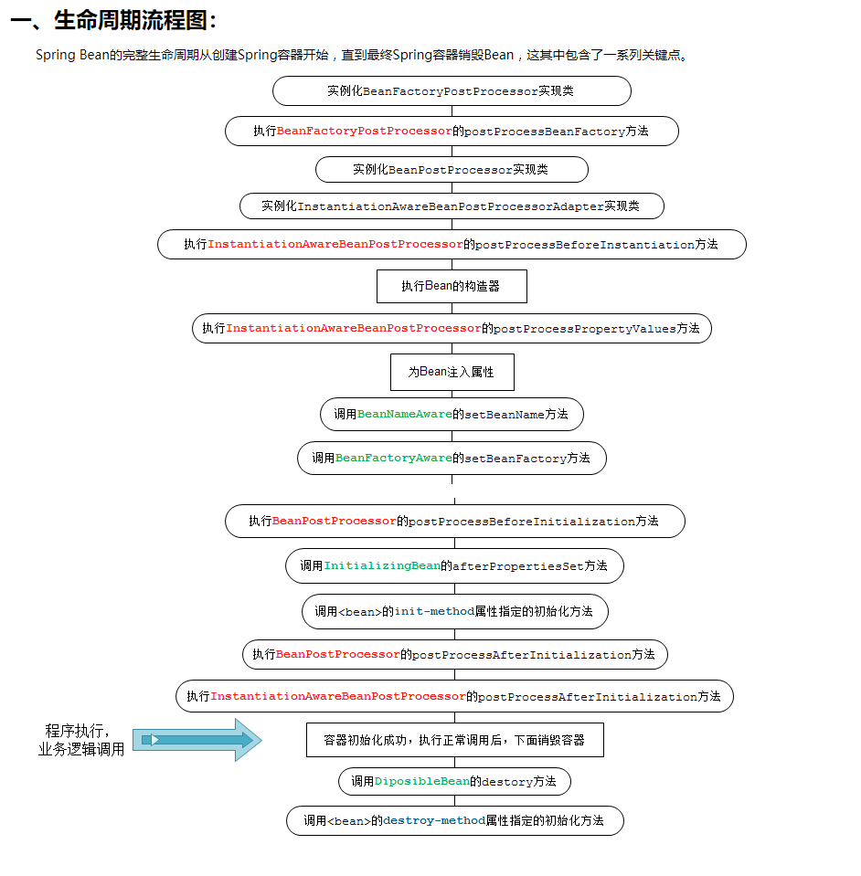

# spring

 [Spring Bean的生命周期（非常详细）](https://www.cnblogs.com/zrtqsk/p/3735273.html)

[九次beanprocess][https://www.cnblogs.com/wl20200316/p/12560920.html]

[Spring 源码之 强大的后置处理器][https://juejin.cn/post/6847902215571505160]

 [springboot aop 自定义注解方式实现完善日志记录（完整源码）](https://www.cnblogs.com/wenjunwei/p/9639909.html)