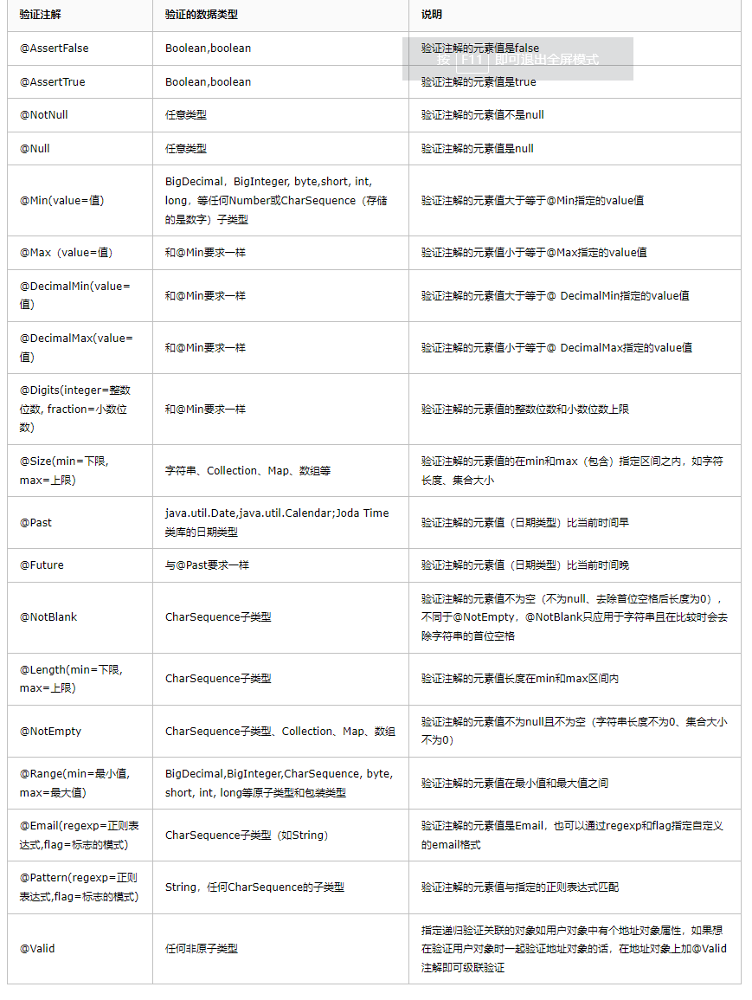

# @validate注解

| 验证注解                                     | 验证的数据类型                                               | 说明                                                         |
| -------------------------------------------- | ------------------------------------------------------------ | ------------------------------------------------------------ |
| @AssertFalse                                 | Boolean,boolean                                              | 验证注解的元素值是false                                      |
| @AssertTrue                                  | Boolean,boolean                                              | 验证注解的元素值是true                                       |
| @NotNull                                     | 任意类型                                                     | 验证注解的元素值不是null                                     |
| @Null                                        | 任意类型                                                     | 验证注解的元素值是null                                       |
| @Min(value=值)                               | BigDecimal，BigInteger, byte,short, int, long，等任何Number或CharSequence（存储的是数字）子类型 | 验证注解的元素值大于等于@Min指定的value值                    |
| @Max（value=值）                             | 和@Min要求一样                                               | 验证注解的元素值小于等于@Max指定的value值                    |
| @DecimalMin(value=值)                        | 和@Min要求一样                                               | 验证注解的元素值大于等于@ DecimalMin指定的value值            |
| @DecimalMax(value=值)                        | 和@Min要求一样                                               | 验证注解的元素值小于等于@ DecimalMax指定的value值            |
| @Digits(integer=整数位数, fraction=小数位数) | 和@Min要求一样                                               | 验证注解的元素值的整数位数和小数位数上限                     |
| @Size(min=下限, max=上限)                    | 字符串、Collection、Map、数组等                              | 验证注解的元素值的在min和max（包含）指定区间之内，如字符长度、集合大小 |
| @Past                                        | java.util.Date,java.util.Calendar;Joda Time类库的日期类型    | 验证注解的元素值（日期类型）比当前时间早                     |
| @Future                                      | 与@Past要求一样                                              | 验证注解的元素值（日期类型）比当前时间晚                     |
| @NotBlank                                    | CharSequence子类型                                           | 验证注解的元素值不为空（不为null、去除首位空格后长度为0），不同于@NotEmpty，@NotBlank只应用于字符串且在比较时会去除字符串的首位空格 |
| @Length(min=下限, max=上限)                  | CharSequence子类型                                           | 验证注解的元素值长度在min和max区间内                         |
| @NotEmpty                                    | CharSequence子类型、Collection、Map、数组                    | 验证注解的元素值不为null且不为空（字符串长度不为0、集合大小不为0） |
| @Range(min=最小值, max=最大值)               | BigDecimal,BigInteger,CharSequence, byte, short, int, long等原子类型和包装类型 | 验证注解的元素值在最小值和最大值之间                         |
| @Email(regexp=正则表达式,flag=标志的模式)    | CharSequence子类型（如String）                               | 验证注解的元素值是Email，也可以通过regexp和flag指定自定义的email格式 |
| @Pattern(regexp=正则表达式,flag=标志的模式)  | String，任何CharSequence的子类型                             | 验证注解的元素值与指定的正则表达式匹配                       |
| @Valid                                       | 任何非原子类型                                               | 指定递归验证关联的对象如用户对象中有个地址对象属性，如果想在验证用户对象时一起验证地址对象的话，在地址对象上加@Valid注解即可级联验证 |

