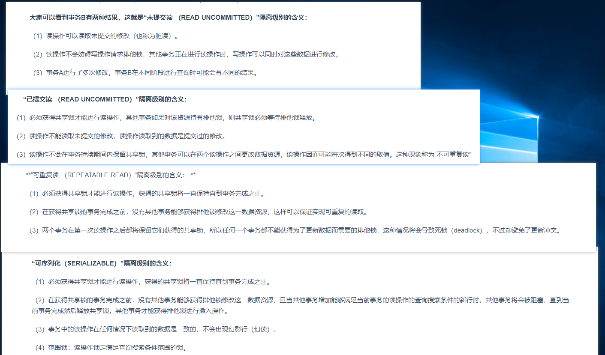

[TOC]


### [mysql死锁，等待资源，事务锁，Lock wait timeout exceeded; try restarting transaction解决](https://www.cnblogs.com/simpledev/p/5426705.html)

### [MySQL事务锁问题-Lock wait timeout exceeded](https://cloud.tencent.com/developer/article/1356959)

```mysql

desc innodb_locks;
desc innodb_lock_waits;
desc innodb_trx ;
show full  processlist;
show engine innodb status

SELECT * FROM information_schema.INNODB_TRX;
SELECT * FROM information_schema.INNODB_LOCKs;
SELECT * FROM information_schema.INNODB_LOCK_waits;


select concat('KILL ',id,';') from information_schema.processlist where user='solar';

show variables like '%timeout%';


SELECT @@GLOBAL.tx_isolation, @@tx_isolation;

SHOW VARIABLES;
SHOW FULL PROCESSLIST;
SELECT * FROM information_schema.innodb_lock_waits;
SELECT * FROM information_schema.innodb_locks;
SELECT * FROM information_schema.innodb_trx;


select @@autocommit;
```

### [MySQL常用字符串函数](https://www.cnblogs.com/geaozhang/p/6739303.html)


### [聚簇索引和非聚簇索引(通俗易懂 言简意赅)](https://www.cnblogs.com/jiawen010/p/11805241.html)


### [MySQL 执行计划详解](https://www.cnblogs.com/yinjw/p/11864477.html)





清空数据库、数据表

```
SELECT concat('DROP TABLE IF EXISTS ', table_name, ';')
FROM information_schema.tables
WHERE table_schema = 'solar_equipment'


select CONCAT('truncate TABLE ',table_schema,'.',TABLE_NAME, ';') from INFORMATION_SCHEMA.TABLES where  table_schema in ('solar_equipment');

```


# [MySQL 日志系统之 redo log 和 binlog](https://www.cnblogs.com/wupeixuan/p/11734501.html)


# [SQL语句执行顺序](https://www.cnblogs.com/yuanshuo/p/11549251.html)

```
一、sql执行顺序 
(1)from 
(3) join 
(2) on 
(4) where 
(5)group by(开始使用select中的别名，后面的语句中都可以使用)
(6) avg,sum.... 
(7)having 
(8) select 
(9) distinct 
(10) order by 
```

