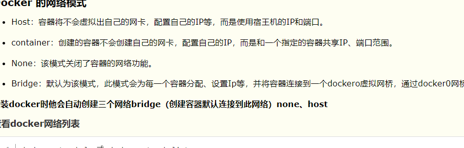

## docker

Ubuntu 14.04.1

### dockerfile

```
FROM java:8
COPY robot-api.jar app.jar
EXPOSE 8086
ENTRYPOINT ["java","-jar","app.jar"]
```


service  docker status


```
docker images 
docker image rm imageid  //删除某个imageid

  docker build -t my/demo .  //注意后面有个.


 docker rmi $(docker images -f "dangling=true" -q) //我们在不断构建的时候，会出现或名称或标签为 none 的无用镜像，我们可以删除它

docker rm containid //删除容器

docker ps -a //看到本机上存在的所有容器
 
docker ps -a -q //列出当前运行的容器， -a 会列出所有，包括已停止的， -q 只列出容器 ID，使用如下命令：

docker ps -a -q | xargs docker rm //删除所有未运行的容器，使用如下命令：
 
docker run -it --name=jialinye/test . //注意后面有个.
 
docker run -d --name test -p 8086:8086 jialinye/test


docker logs --tail  300 -f  test  //查看启动日志,test为容器名称

 docker update –-restart=always test   //已经运行的docker容器怎么设置自动重启 test为容器名称
 
```


> docker exec –it mycat /bin/bash  //mycat为名称，进入一个running状态的容器


### docker-compose安装

http://get.daocloud.io/   


### docker进入，退出容器命令

```
进入容器命令：

docker attach 容器ID
或者

docker exec -it 容器ID /bin/bash 
或者

docker exec -it 容器的name bash
退出容器命令

exit
或者

Ctrl+P+Q
```


### docker启动命令

```
docker ps -a　查看本地所有运行的容器
docker ps        产看正在运行的容器
docker start 容器id 运行容器
docker rm 容器id    移出容器


docker ps // 查看所有正在运行容器
$ docker stop containerId // containerId 是容器的ID

$ docker ps -a // 查看所有容器
$ docker ps -a -q // 查看所有容器ID

$ docker stop $(docker ps -a -q) //  stop停止所有容器
$ docker  rm $(docker ps -a -q) //   remove删除所有容器
```


docker的网络模式




docker 中 启动所有的容器命令

```
docker start $(docker ps -a | awk '{ print $1}' | tail -n +2)
```

docker 中 关闭所有的容器命令

```
docker stop $(docker ps -a | awk '{ print $1}' | tail -n +2)
```

docker 中 删除所有的容器命令

```
docker rm $(docker ps -a | awk '{ print $1}' | tail -n +2)
```

docker 中 删除所有的镜像

```
docker rmi $(docker images | awk '{print $3}' |tail -n +2)
```

 

ps:

```
echo "aa bb cc" | awk -F '{print $1}' 结果就是aa，意思是把字符串按空格分割，取第一个。

awk 是用来提取列的主要工具；
{print $1} 就是将某一行（一条记录）中以空格为分割符的第一个字段打印出来。
```

tail -n +2 表示从第二行开始读取

 

// 事例

docker start $(docker ps -aq) # 启动所有容器

docker start $(docker ps -aq -f status=exited) # 启动所有状态为 exited 的容器，和上面的命令效果一致 

docker rm $(docker ps -q --filter "status=exited") 


## 启动失败的docker 查看日志


在使用[docker](https://so.csdn.net/so/search?q=docker&spm=1001.2101.3001.7020)的时候，在某些未知的情况下可能启动了容器，但是过了没几秒容器自动退出了。这个时候如何排查问题呢?

通常碰到这种情况无非就是环境有问题或者应用有问题，应用问题再本地可以进行调试解决，但是环境问题就比较头疼了。这个时候我们就需要查看容器的日志来进行排查。

这里我们的容器id=60f486ec7c33

我们可以通过如下命令来获取容器的日志地址

docker inspect --format '{{.LogPath}}' 60f486ec7c33

然后通过cat命令查看上述命令找到的日志地址

cat /var/lib/docker/containers/97069f94437b86b50341f8253d85f426884315c3d027f7b7fa975751c7d8e18e/97069f94437b86b50341f8253d85f426884315c3d027f7b7fa975751c7d8e18e-json.log

命令解释：

docker inspect 用于获取容器/镜像的元数据。其中就包含容器日志的地址，上述命令只是增加了一个–format参数用于将日志地址过滤出来。

docker inspect 中有很多信息，具体的大家可以自行查看。

发现有更简单的命令

docker logs 60f486ec7c33