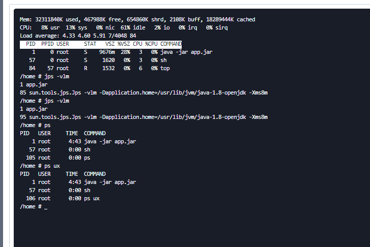
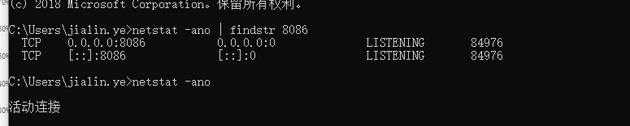

### k8s查看启动命令

### windows下查看端口pid

**Harbor**  → maven仓库

 kubectl get pods -n  dev //pod运行状态**STATUS*

# Kubernetes入门

1. https://www.cnblogs.com/zuoyang/p/9639961.html
2. https://my.oschina.net/u/4381723/blog/4439479

## [CentOS7安装单机kubernetes和Docker](https://www.cnblogs.com/com3/articles/13255342.html)

查看k8s容器内日志

> kubectl get pods 
>
> kubectl logs -f --tail 200 solar-iotservice-deploy-784679965f-4snxw 

kubectl exec -it <podName> -c <containerName> -n <namespace> -- shell comand

> 

> #适用于当前pod只有一个容器
> kubectl exec -it superset-3fpnq -- /bin/bash      

> #适用于当前pod只有一个容器 --container or -c 参数
> kubectl exec -it superset-3fpnq --container main-app -- /bin/*bash*  

> 张铮(Zheng ZHANG) 1-15 11:34:57
> 10.246.0.4  UplusIoTSolarUser r7myyOsL0g7D
>
> 张铮(Zheng ZHANG) 1-15 11:35:23
> 登陆后执行  sudo su -  切换到root

kubectl exec -it solar-iotservice-deploy-79698cfb95-9zfbw -- /bin/bash   

kubectl logs -f --tail 200 solar-iotservice-deploy-79698cfb95-22m8g

kubectl logs -f --tail 200 solar-iotservice-deploy-79698cfb95-7qj5f

重启  kubectl delete po solar-iotservice-deploy-79698cfb95-7qj5f

> kubectl get configmap | grep iot
> kubectl edit configmap solar-iotservice-config
> kubectl get po
> kubectl delete po solar-iotservice-deploy-784679965f-4snxw
>
> kubectl logs solar-iotservice-deploy-79698cfb95-9zfbw >log.txt  导出日志到文件中

