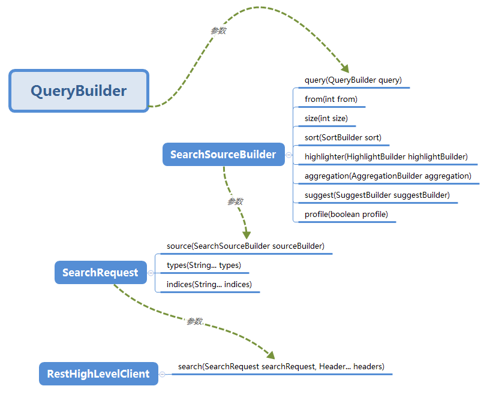

## [Elasticsearch Java Rest Client API 整理总结 (三)——Building Queries](https://www.cnblogs.com/reycg-blog/p/9993094.html)




## [ElasticSearch AggregationBuilders java api常用聚会查询](https://www.cnblogs.com/moxiaotao/p/10843523.html)


## es查询语句


```
        SearchRequestBuilder businessSearchRequestBuilder = esUtil.getBusinessSearchRequestBuilder(EsChatHistoryConst.INDEX, EsChatHistoryConst.TYPE);
        SearchRequestBuilder searchRequestBuilder = businessSearchRequestBuilder.setQuery(getQueryBuilderBySession(sessionId)).addSort(EsChatHistoryConst.QUESTION_TIME, SortOrder.DESC);
        Pagination<EsChatHistory> esChatHistoryList = esUtil.getEsBusinessPageList(size, page, searchRequestBuilder, EsChatHistory.class);
```


> ```
> BoolQueryBuilder questionLikeQB;
> BoolQueryBuilder answerLikeQB;
> 
> if (Boolean.TRUE.equals(searchConfig.getDefaultrobotable())) {
> 	questionLikeQB = QueryBuilders.boolQuery().must(getWildcardQueryQB(keyword)).must(getActiveQB()).must(QueryBuilders.boolQuery().should(getRobotIdQB(robotCode)).should(getRobotIdQB(searchConfig.getDefaultrobotcode())));
> 	answerLikeQB = QueryBuilders.boolQuery().must(getWildcardSimilarQB(keyword)).must(getActiveQB()).must(QueryBuilders.boolQuery().should(getRobotIdQB(robotCode)).should(getRobotIdQB(searchConfig.getDefaultrobotcode())));
> } else {
> 	questionLikeQB = QueryBuilders.boolQuery().must(getRobotIdQB(robotCode)).must(getWildcardQueryQB(keyword)).must(getActiveQB());
> 	answerLikeQB = QueryBuilders.boolQuery().must(getRobotIdQB(robotCode)).must(getWildcardSimilarQB(keyword)).must(getActiveQB());
> }
> return QueryBuilders.boolQuery().should(questionLikeQB).should(answerLikeQB);
> 
> 
> ```

> ```
> BoolQueryBuilder boolQueryBuilder = QueryBuilders.boolQuery().must(getRobotCodeQB(robotCode));
> if (startTime != null && endTime != null) {
> SimpleDateFormat sdf = new SimpleDateFormat(YYYY_MM_DD_HH_MM_SS);
> String lte = sdf.format(startTime);
> String gte = sdf.format(endTime);
> boolQueryBuilder.must(rangequerybuilder(lte, gte));
> }
> if (!StringUtils.isEmpty(useOrSessionId)) {
> BoolQueryBuilder shouldQuery = QueryBuilders.boolQuery();
> shouldQuery.should(getSessionIdQB(useOrSessionId)).should(getUseIdQB(useOrSessionId));
> boolQueryBuilder.must(shouldQuery);
> }
> 
> return boolQueryBuilder;
> ```