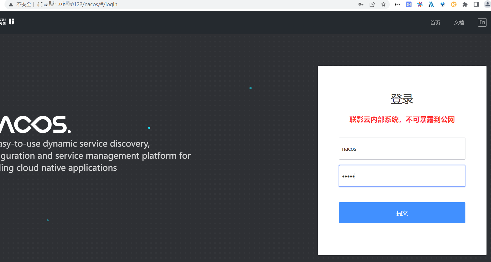
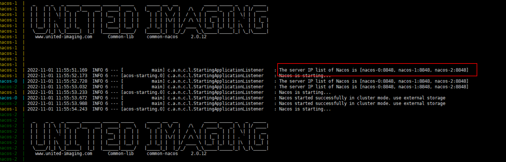

[TOC]


# docker下nacos安装

## 运行环境

- 需安装docker环境，版本 19+

## 注意事项

- U+针对nacos做了部分增强性功能（目前nacos版本是2.1.0）
- 依赖Mysql数据库，第一次启动Nacos前需要手动初始化 数据库common_nacos.sql和ddl_v1.sql

## 安装步骤

### Standalone

1. 在mysql数据中执行common_nacos.sql和ddl_v1.sql初始化脚本

2. 定位到standalone文件夹,将bootstrap.yml中更换为实际值

   ```
   db:
     num: 1
     user: {mysqluser}
     password: {mysqlpassword}
     url:
       0: jdbc:mysql://{ip}:{port}/common_nacos?characterEncoding=utf8&zeroDateTimeBehavior=convertToNull&useSSL=false&useJDBCCompliantTimezoneShift=true&useLegacyDatetimeCode=false&serverTimezone=GMT%2B8&nullCatalogMeansCurrent=true&allowPublicKeyRetrieval=true
   
   ```

   将nacos_test镜像版本更换为实际值。docker-compose.yml 中的镜像版本与实际版本一致，现场环境需要将`registry-dev.uihcloud.cn`替换为现场私服地址。如果现场无私服，镜像通过文件导入的方式导入服务器，则需要将`registry-dev.uihcloud.cn/`删除

   ```
   services:
     nacos_test:
       image: registry-dev.uihcloud.cn/com.uih.uplus.base/nacos:dev-20220607-20041
   ```

   

3. 定位到standalone文件夹，执行 sh install_standalone.sh

4. 打开 http://docker-host-ip:30122/nacos ，用户名/密码为 nacos/nacos



### 集群模式

1. 在mysql数据中执行common_nacos.sql和ddl_v1.sql初始化脚本

2. 定位到install_cluster文件夹,将bootstrap.yml中更换为实际值

   ```
   db:
     num: 1
     user: {mysqluser}
     password: {mysqlpassword}
     url:
       0: jdbc:mysql://{ip}:{port}/common_nacos?characterEncoding=utf8&zeroDateTimeBehavior=convertToNull&useSSL=false&useJDBCCompliantTimezoneShift=true&useLegacyDatetimeCode=false&serverTimezone=GMT%2B8&nullCatalogMeansCurrent=true&allowPublicKeyRetrieval=true
   
   ```

   将nacos-0，nacos-1,nacos-2镜像版本更换为实际值。docker-compose.yml 中的镜像版本与实际版本一致，现场环境需要将`registry-dev.uihcloud.cn`替换为现场私服地址。如果现场无私服，镜像通过文件导入的方式导入服务器，则需要将`registry-dev.uihcloud.cn/`删除

   ```
   services:
     nacos-0:
       image: registry-dev.uihcloud.cn/com.uih.uplus.base/nacos:dev-20220607-20041
   ```

   

3. 定位到install_cluster文件夹，执行 sh install_cluster.sh

4. 查看log，有图中所示即代表集群模式成功




