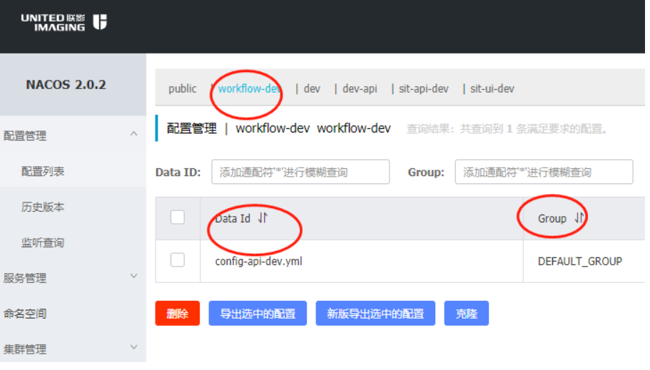
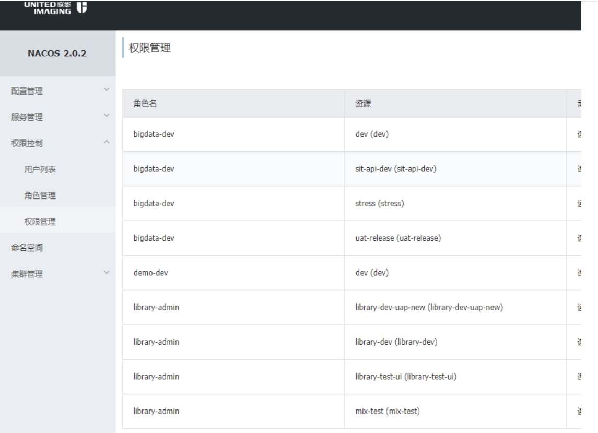
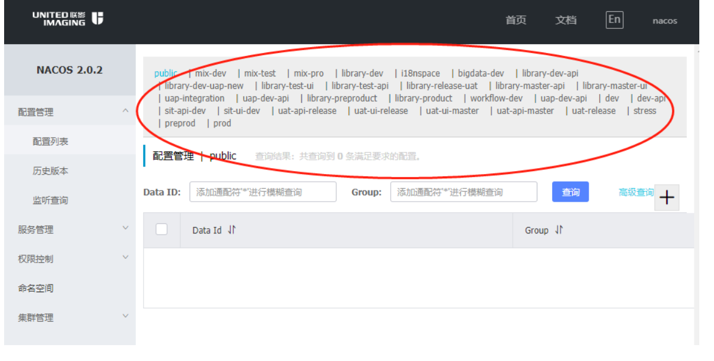
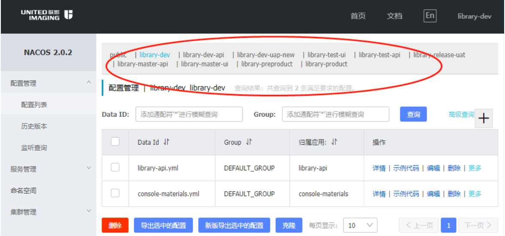
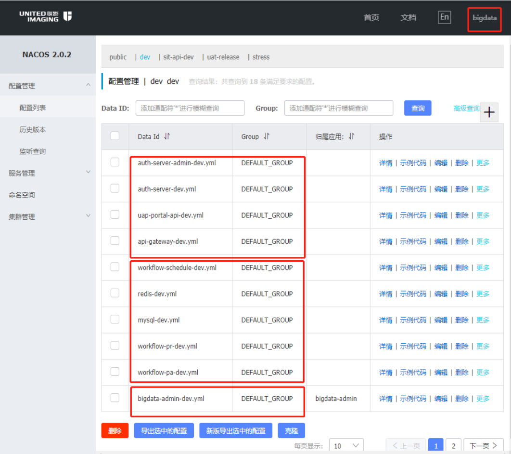
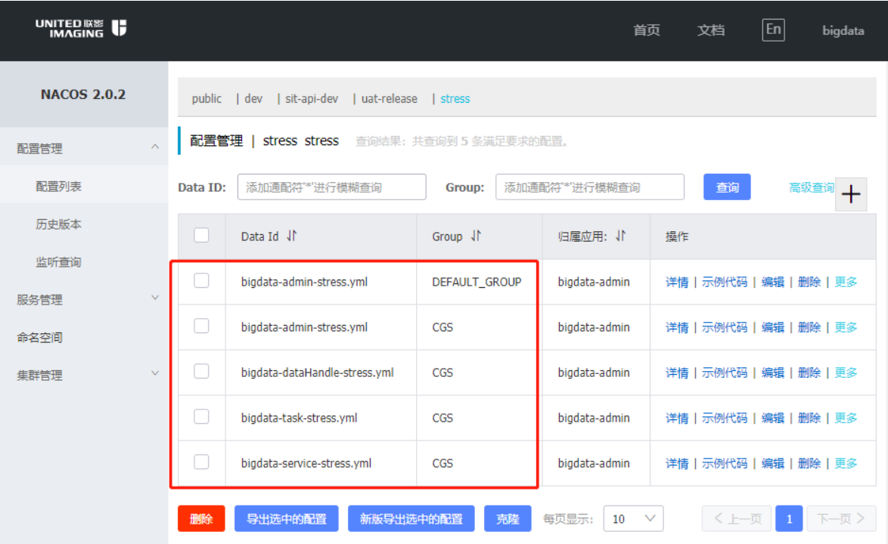

# 为什么要进行改造

ref:https://navi.united-imaging.com/ugalaxy/UCloud/_wiki/wikis/UCloud.wiki/1622/common-nacos-%E6%94%B9%E9%80%A0%E8%AF%B4%E6%98%8E

当前nacos的 console 只是一个简单的RBCA模型的管理后台,对于权限控制和安全访问方便不能满足业务需求

## nacos 背景简介

### nacos 领域模型

Nacos 数据模型 Key 由三元组唯一确定, Namespace默认是空串，公共Namespace（public），分组默认是 DEFAULT_GROUP。

体现在具体页面如图:

### 权限模型

标准的RBCA 模型 , 用户绑定角色 ,通过给角色赋予Namespace来控制用户权限

## 不满足联影业务体现

### 1. Namespace对所有的用户开放

官方虽然使用RBCA 来控制用户对Namespace内的配置修改,但是没有对Namespace的显示权限进行控制.拿library-dev 用户举例来说:使用中出现的问题是(原版本没部署,以nacos用户来举例):

实际我们想要的是:

### 2. 权限的粒度只能到Namespace

针对这个现状我们有2种使用方案:

#### 2.1 U课堂 和 UAP 同一套环境(dev) 我创建2个Namespace

由于Namespace 在领域模型是完全隔离的,应该属于环境级别的(dev ,test),导致U课堂想通过注册中心访问到Uap是无法访问的,不利于我们后面接Fegin 相关的Rpc 框架

#### 2.2 U课堂 和 UAP 使用同一个 Namespace

但是业务上为了安全考虑,要求对不同的Scrum team 的配置隔离,比如U课堂的用户登录不应该看到UAP的配置文件
存在的问题截图

## 改造完变化是什么?

1. 解决Namespace对所有的用户开放问题
   方案 : 在页面加载的时候,会根据当前用户角色所拥有的Namespace 进行过滤
2. 解决权限的力度只能到Namespace
   方案: 本着 配置中心和注册中心分离的思路,即 注册中心保持官方不变 U课堂和 UAP 在同一个 Namespace 和 同一个 GROUP,保证能相互识别调用
   配置中心 则采用GROUP 隔离方法,即 U课堂和 UAP 应该在同一个 Namespace,但是属于不同的GROUP
   解决后如图:
   

# 源码改造记录

改造原则: 尽量减少源码入侵,方便以后升级
改造工程: 目前只涉及到 console 和 console-ui 部分 核心部分未修改
具体记录:

## console-ui

## console

后端改造基本上都放在了 uih 目录,后续直接copy这个目录到新项目即可