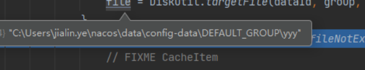
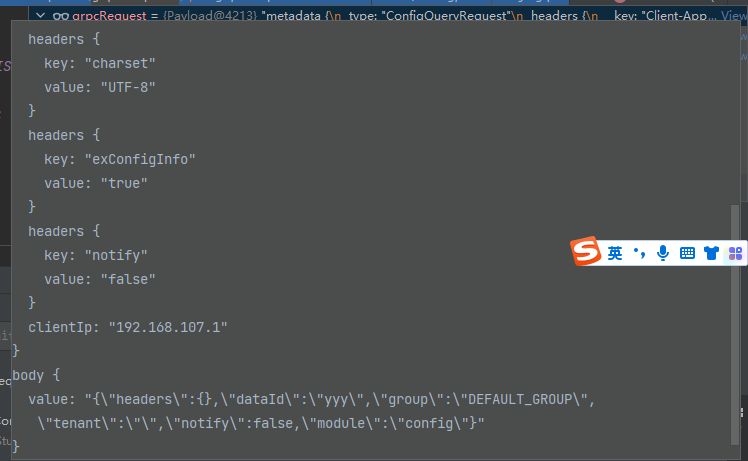
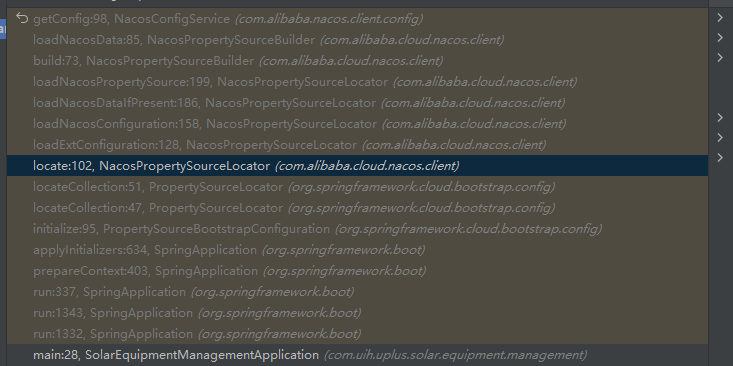

## 1.4.1








```
NacosConfigBootstrapConfiguration>NacosConfigManager>createConfigService>NacosFactory.createConfigService>constructor.newInstance(properties)>NacosConfigService(Properties properties)
```




```
SpringApplication->applyInitializers>initializer.initialize(context)
	
	PropertySourceBootstrapConfiguration.class>initialize>source = locator.locateCollection(environment);>
	     data = this.configService.getConfig(dataId, group, this.timeout);
		
```


```
NacosConfigProperties
```


变更通知

```
AsyncNotifyService
```