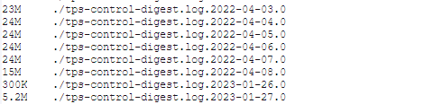
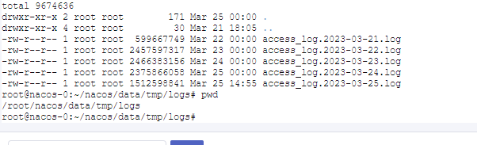

压缩命令

```
zip -r test.zip ./Solar/* .metadata.yml
```

登陆远程服务器

```
ssh root@10.2.18.153
```


下载文件到本地

```
sz 下载
rz 上传
```


服务器缓存位置

```
C:\Users\jialin.ye\nacos\data\tenant-config-data

```


客户端

```
{user.home}/nacos/config/fixed-nacos-dev.uihcloud.cn-dev_nacos/snapshot-tenant/dev/Sola

C:\Users\jialin.ye\nacos\config\fixed-nacos-dev.uihcloud.cn-local_nacos\snapshot-tenant\local\Solar

/root/nacos/config/fixed-nacos-dev.uihcloud.cn-dev_nacos/snapshot-tenant/dev/Sola
```


curl https://nacos-dev.uihcloud.cn/nacos/v1/auth/users/login -F "username=solar-uda" -F "password=N@2o22ac0s^8"


Spring5-09-jdbcTemplate

https://blog.csdn.net/qq_52297656/article/details/125792137


k8s秘钥

```
echo -n "Max1qaz@WSX" | base64

echo -n "TWF4MXFhekBXU1g=" | base64 -d
```


https://github.com/alibaba/spring-cloud-alibaba/wiki/Nacos-config

https://nacos.io/zh-cn/docs/quick-start-spring-cloud.html


c# 

.net6使用nacos作为配置中心 http://tnblog.net/aojiancc2/article/details/7870

ASP.NET Core集成Nacos配置中心之适配多格式配置https://mp.weixin.qq.com/s/jAr1pPNXWfdF2QO2dN5sdw


apigateway https://navi.united-imaging.com/uGalaxy/UCloud/_wiki/wikis/UCloud.wiki/373/R12-SP2-API-Gateway%E8%AF%B4%E6%98%8E


casbin

https://casbin.org/zh/docs/get-started


在nginx目录打开cmd命令行，执行以下：

```sql
start nginx
```

在浏览器地址栏输入网址 [http://localhost:80](http://localhost/)，查看是否启动成功

## 关闭

```bash
nginx -s stop 立即停止nginx,不保存相关信息
nginx -s quit 正常退出nginx,并保存相关信息
nginx -s reload 重启(改变配置后,需重启)
taskkill /f /t /im nginx.exe 彻底关闭
```

## 配置


运维 --- Nginx中的概念和配置详解（二）https://developer.aliyun.com/article/1169682?spm=a2c6h.12873639.article-detail.26.11586388AUVXYE#slide-7

【实用篇】Nginx的配置文件以及案例详细配置实现  https://blog.csdn.net/tf835991342/article/details/121751724


curl optionshttp://www.manongjc.com/detail/20-ijrfzozgrgwfaye.html


OpenResty 最佳实践https://www.w3cschool.cn/openresty1/openresty-nginx%E5%8F%8D%E5%90%91%E4%BB%A3%E7%90%86.html


在线配置nginx网站https://www.digitalocean.com/community/tools/nginx?global.app.lang=zhCN


spring boot下定期清除tomcat accessLog日志 https://blog.csdn.net/qdqht2009/article/details/77884321


实际日志文件位置






http://localhost:19103/configInfo  


http://localhost:8090/  nacos单独前端，注意不带nacos

http://10.5.67.12:8848/nacos/swagger-ui/index.html#   nacos swagger


180上环境地址

集群安装/usr/local下


/home/upgrade


