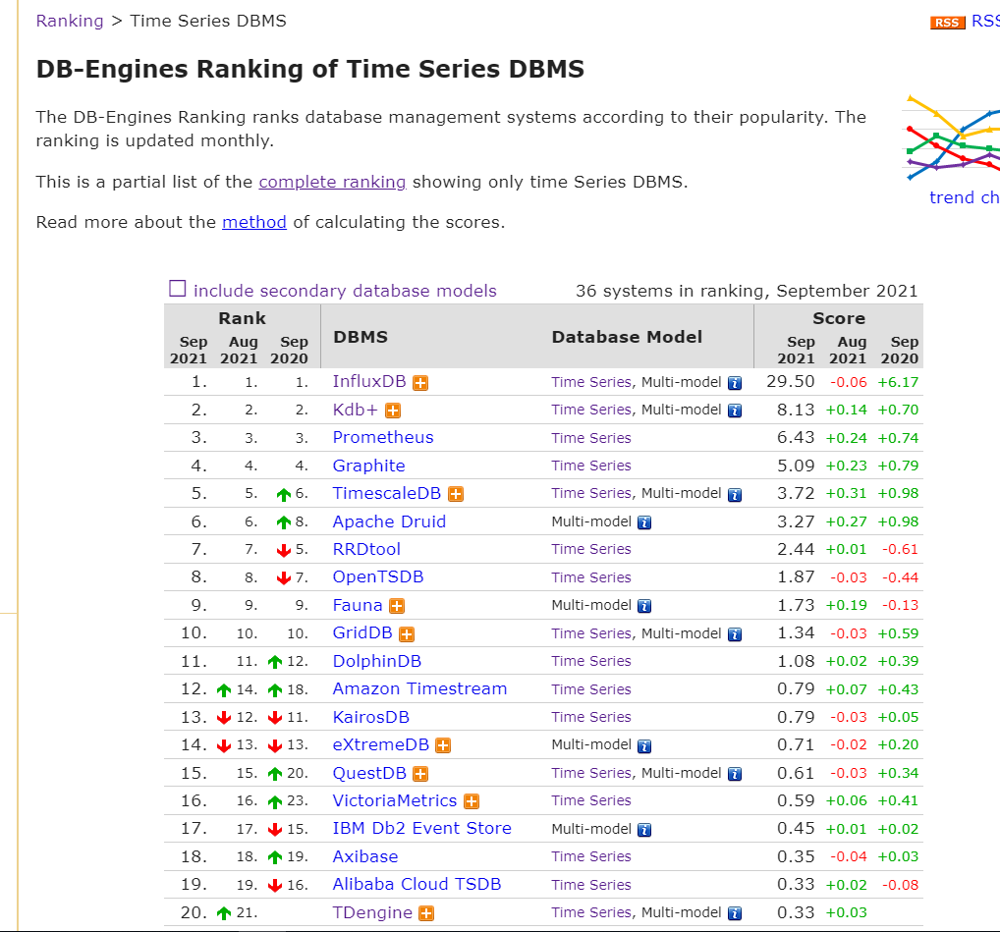
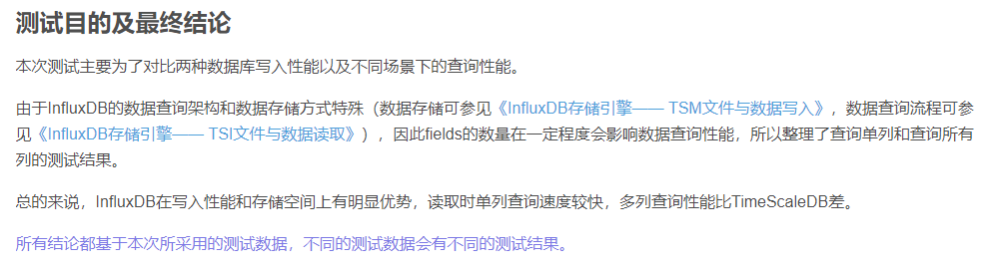

[TOC]

# uDeviceAccess时序数据库选型

## 背景

uDeviceAccess项目（以下简称DA）中需要提供心跳服务和遥测数据上传服务，经分析发现这二个接口服务都跟时间很相关，很符合时序数据库的数据特点。

## 要求

- 心跳接口 每5min记录设备状态（设备主动调DA心跳接口）

- 遥测接口  记录设备上传上来的遥测数据，可供后面的相关查询。

  以上数据默认保持七天

## 时序数据库简介

时序数据库全称为时间序列数据库。时间序列数据库主要用于指处理带时间标签（按照时间的顺序变化，即时间序列化）的数据，带时间标签的数据也称为时间序列数据。时序数据的兴起还是榜上了物联网的大风。物联网（Internet of Things，简称IOT）是指通过各种信息传感器实时采集任何需要管理设备的信息，并进行管理。物联网的基础数据具有数据量大、结构单一、时间属性强、查询简单等特点，传统的关系型数据库在面对物联网数据时，显得应对发力，基本上属于功能过剩但性能不足

## 时序数据库排名

目前最新的DB-Engine上时序数据库排名如下（2021.09）

## 几大时序数据库简介

### Timescale

这个数据库其实就是一个基于传统关系型数据库postgresql改造的时间序列数据库。了解postgresql的同学都知道，postgresql是一个强大的，开源的，可扩展性特别强的一个数据库系统。

于是timescale.inc开发了Timescale，一款兼容sql的时序数据库， 底层存储架构在postgresql上。 作为一个postgresql的扩展提供服务。其特点如下：

**基础：**

- PostgreSQL原生支持的所有SQL,包含完整SQL接口（包括辅助索引，非时间聚合，子查询，JOIN，窗口函数）
- 用PostgreSQL的客户端或工具，可以直接应用到该数据库，不需要更改。
- 时间为导向的特性，API功能和相应的优化。
- 可靠的数据存储。

**扩展：**

- 透明时间/空间分区，用于放大（单个节点）和扩展
- 高数据写入速率（包括批量提交，内存中索引，事务支持，数据备份支持)
- 单个节点上的大小合适的块（二维数据分区），以确保即使在大数据量时即可快速读取。
- 块之间和服务器之间的并行操作

**劣势：**

- 因为TimescaleDB没有使用列存技术，它对时序数据的压缩效果不太好，压缩比最高在4X左右
- 目前暂时不完全支持分布式的扩展（正在开发相关功能），所以会对服务器单机性能要求较高

### Influxdb

Influxdb是业界比较流行的一个时间序列数据库，特别是在IOT和监控领域十分常见。其使用go语言开发，突出特点是性能。

**特性：**

- 高效的时间序列数据写入性能。自定义TSM引擎，快速数据写入和高效数据压缩。
- 无额外存储依赖。
- 简单，高性能的HTTP查询和写入API。
- 以插件方式支持许多不同协议的数据摄入，如：graphite，collectd，和openTSDB
- SQL-like查询语言，简化查询和聚合操作。
- 索引Tags，支持快速有效的查询时间序列。
- 保留策略有效去除过期数据。
- 连续查询自动计算聚合数据，使频繁查询更有效。

Influxdb已经将分布式版本转为闭源。所以在分布式集群这块是一个弱点，需要自己实现。

[InfluxDB vs TimeScaleDB 功能/性能对比 （二）](https://blog.csdn.net/suzy1030/article/details/81486234?utm_medium=distribute.pc_relevant.none-task-blog-2~default~baidujs_baidulandingword~default-1.no_search_link&spm=1001.2101.3001.4242)

###  OpenTSDB

The Scalable Time Series Database. 打开OpenTSDB官网，第一眼看到的就是这句话。其将Scalable作为其重要的特点。OpenTSDB运行在Hadoop和HBase上，其充分利用HBase的特性。通过独立的Time Series Demon(TSD)提供服务，所以它可以通过增减服务节点来轻松扩缩容。

- Opentsdb是一个基于Hbase的时间序列数据库（新版也支持Cassandra）。

  其基于Hbase的分布式列存储特性实现了数据高可用，高性能写的特性。受限于Hbase，存储空间较大，压缩不足。依赖整套HBase, ZooKeeper

- 采用无模式的tagset数据结构(sys.cpu.user 1436333416 23 host=web01 user=10001)

  结构简单，多value查询不友好

- HTTP-DSL查询

### Druid

Druid是一个实时在线分析系统(LOAP)。其架构融合了实时在线数据分析，全文检索系统和时间序列系统的特点，使其可以满足不同使用场景的数据存储需求。

- 采用列式存储：支持高效扫描和聚合，易于压缩数据。
- 可伸缩的分布式系统：Druid自身实现可伸缩，可容错的分布式集群架构。部署简单。
- 强大的并行能力：Druid各集群节点可以并行地提供查询服务。
- 实时和批量数据摄入：Druid可以实时摄入数据，如通过Kafka。也可以批量摄入数据，如通过Hadoop导入数据。
- 自恢复，自平衡，易于运维：Druid自身架构即实现了容错和高可用。不同的服务节点可以根据响应需求添加或减少节点。
- 容错架构，保证数据不丢失：Druid数据可以保留多副本。另外可以采用HDFS作为深度存储，来保证数据不丢失。
- 索引：Druid对String列实现反向编码和Bitmap索引，所以支持高效的filter和groupby。
- 基于时间分区：Druid对原始数据基于时间做分区存储，所以Druid对基于时间的范围查询将更高效。
- 自动预聚合：Druid支持在数据摄入期就对数据进行预聚合处理。

Druid架构蛮复杂的。其按功能将整个系统细分为多种服务，query、data、master不同职责的系统独立部署，对外提供统一的存储和查询服务。其以分布式集群服务的方式提供了一个底层数据存储的服务。

### Elasticsearch

Elasticsearch 是一个分布式的开源搜索和分析引擎，适用于所有类型的数据，包括文本、数字、地理空间、结构化和非结构化数据。Elasticsearch 在 Apache Lucene 的基础上开发而成，由 Elasticsearch N.V.（即现在的 Elastic）于 2010 年首次发布。Elasticsearch 以其简单的 REST 风格 API、分布式特性、速度和可扩展性而闻名。

Elasticsearch以ELK stack被人所熟知。许多公司基于ELK搭建日志分析系统和实时搜索系统。之前我们在ELK的基础上开始开发metric监控系统。即想到了使用Elasticsearch来存储时间序列数据库。对Elasticserach的mapping做相应的优化，使其更适合存储时间序列数据模型，收获了不错的效果，完全满足了业务的需求。后期发现Elasticsearch新版本竟然也开始发布Metrics组件和APM组件，并大量的推广其全文检索外，对时间序列的存储能力。真是和我们当时的想法不谋而合。

Elasticsearch的时序优化可以参考一下这篇文章:[《elasticsearch-as-a-time-series-data-store》](https://www.elastic.co/cn/blog/elasticsearch-as-a-time-series-data-store)

也可以去了解一下Elasticsearch的Metric组件：[Elastic Metrics](https://www.elastic.co/cn/products/infrastructure-monitoring)

### Beringei

Beringei是Facebook在2017年最新开源的一个高性能内存时序数据存储引擎。其具有快速读写和高压缩比等特性。

2015年Facebook发表了一篇论文《[Gorilla: A Fast, Scalable, In-Memory Time Series Database](http://www.vldb.org/pvldb/vol8/p1816-teller.pdf) 》，Beringei正是基于此想法实现的一个时间序列数据库。

Beringei使用Delta-of-Delta算法存储数据，使用XOR编码压缩数值。使其可以用很少的内存即可存储下大量的数据。

## 如何选择一个适合自己的时间序列数据库

- Data model

  时间序列数据模型一般有两种，一种无schema，具有多tag的模型，还有一种name、timestamp、value型。前者适合多值模式，对复杂业务模型更适合。后者更适合单维数据模型。

- Query language

  目前大部分TSDB都支持基于HTTP的SQL-like查询。

- Reliability

  可用性主要体现在系统的稳定高可用上，以及数据的高可用存储上。一个优秀的系统，应该有一个优雅而高可用的架构设计。简约而稳定。

- Performance

  性能是我们必须考虑的因素。当我们开始考虑更细分领域的数据存储时，除了数据模型的需求之外，很大的原因都是通用的数据库系统在性能上无法满足我们的需求。大部分时间序列库倾向写多读少场景，用户需要平衡自身的需求。

- Ecosystem

  我一直认为生态是我们选择一个开源组件必须认真考虑的问题。一个生态优秀的系统，使用的人多了，未被发现的坑也将少了。另外在使用中遇到问题，求助于社区，往往可以得到一些比较好的解决方案。另外好的生态，其周边边界系统将十分成熟，这让我们在对接其他系统时会有更多成熟的方案。

- Operational management

  易于运维，易于操作。

- Company and support

  一个系统其背后的支持公司也是比较重要的。背后有一个强大的公司或组织，这在项目可用性保证和后期维护更新上都会有较大的体验。

## 性能对比

|                    | Timescale | InfluxDB | OpenTSDB | Druid    | Elasticsearch | Beringei |
| ------------------ | --------- | -------- | -------- | -------- | ------------- | -------- |
| write(single node) | 15K/sec   | 470k/sec | 32k/sec  | 25k/sec  | 30k/sec       | 10m/sec  |
| write(5 node)      |           |          | 128k/sec | 100k/sec | 120k/sec      |          |

## 总结

可以按照以下需求自行选择合适的存储：

- 小而精，性能高，数据量较小(亿级): InfluxDB
- 简单，数据量不大（千万级），有联合查询、关系型数据库基础：timescales
- 数据量较大，大数据服务基础，分布式集群需求： opentsdb、KairosDB
- 分布式集群需求，olap实时在线分析，资源较充足：druid
- 性能极致追求，数据冷热差异大：Beringei
- 兼顾检索加载，分布式聚合计算： elsaticsearch

  

## 最后

Influxdb作为业界比较流行的一个时间序列数据库，拥有强大的生态系统和社区，比较容易上手的UI等。能满足我们的业务需要，快速的进行开发。故此我们选择infuxDB

