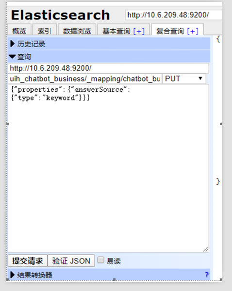
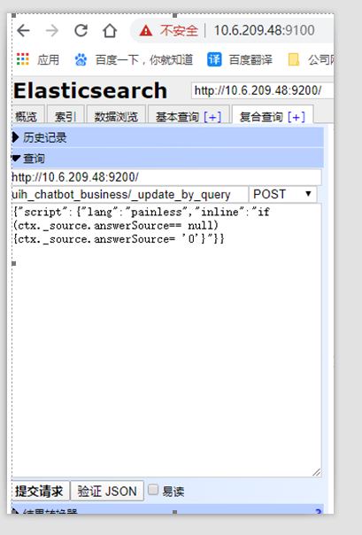
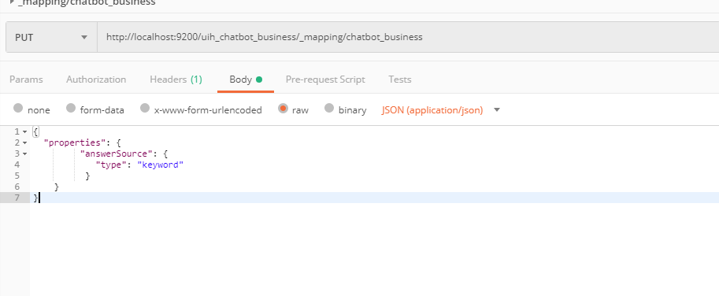
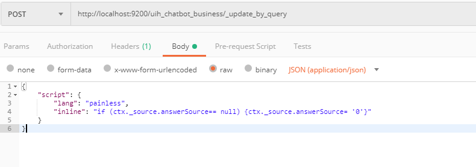
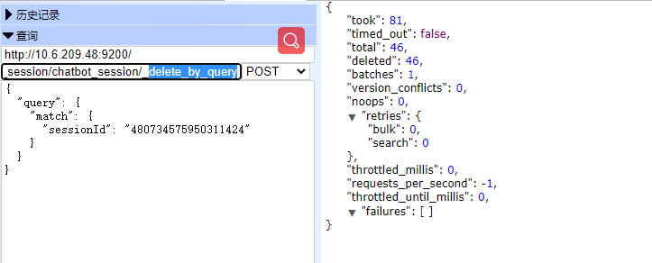
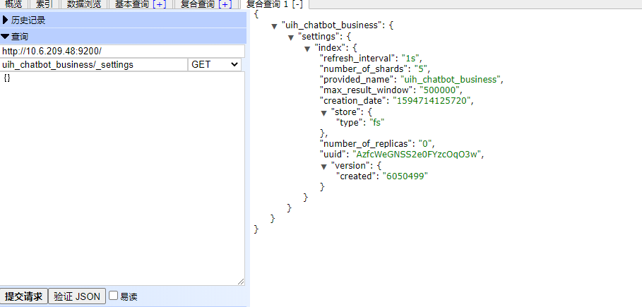

[[_TOC_]]

# es相关整理

## es 不停机重建索引

### 1、增加字段

通过kibana修改已经建好的索引的字段类型或索引类型

GET /uih_chatbot_business11/_mapping/
得到如下结果

``` json
{
  "uih_chatbot_business11": {
    "mappings": {
      "chatbot_business": {
        "properties": {
          "active": {
            "type": "boolean"
          },
          "answer": {
            "type": "keyword"
          },
          "answerDetail": {
            "type": "long"
          },
          "clickNum": {
            "type": "long",
            "index": false
          },
          "createDateTime": {
            "type": "date",
            "index": false,
            "fields": {
              "keyword": {
                "type": "keyword"
              }
            },
            "format": "yyyy-MM-dd HH:mm:ss"
          },
          "deleted": {
            "type": "boolean"
          },
          "modifyDateTime": {
            "type": "date",
            "index": false,
            "format": "yyyy-MM-dd HH:mm:ss"
          },
          "question": {
            "type": "text",
            "fields": {
              "keyword": {
                "type": "keyword"
              }
            },
            "analyzer": "ik_smart"
          },
          "robotCode": {
            "type": "keyword"
          },
          "ruleType": {
            "type": "keyword"
          },
          "similar": {
            "type": "text",
            "fields": {
              "keyword": {
                "type": "keyword"
              }
            },
            "analyzer": "ik_smart"
          },
          "sort": {
            "type": "keyword",
            "fields": {
              "keyword": {
                "type": "keyword"
              }
            }
          },
          "unusefulNum": {
            "type": "long",
            "index": false
          },
          "usefulNum": {
            "type": "long",
            "index": false
          }
        }
      }
    }
  }
}
```

update

``` json
POST /uih_chatbot_business11/chatbot_business/_mapping?pretty
{
  "properties": {
    "addindex":{
      "index":true,
      "type":"keyword"
    }
  }
```

### 2、用水杯倒腾（暂停使用）

————————————————
https://blog.csdn.net/wuqixiufen2/java/article/details/104793172
————————————————
由于ElasticSearch没有像mysql一样可以直接字段数据类型的方法，因此需要通过创建中间索引:data_index_1，备份数据到中间索引:data_index_1，然后删除原索引: data_index，重新创建正确数据类型索引：data_index，再把中间索引:data_index_1的数据备份到新创建索引：data_index。语句通过kibana的 dev_tools/console 执行


```
1. 创建一个中间索引
2. 向中间索引备份源索引的数据(mapping)
3. 查询确认数据是否copy过去
4. 删除有问题的索引
5. 重新创建同名的索引(★字段类型修改正确★)
6. 从中间索引还原到源索引的数据
7. 删除中间索引
```


```json
PUT uih_chatbot_business_v2/


POST uih_chatbot_business_v2/chatbot_business/_mapping
{  
    "chatbot_business": {
        "properties": {
          "active": {
            "type": "boolean"
          },
          "answer": {
            "type": "keyword"
          },
          "answerDetail": {
            "type": "long"
          },
          "clickNum": {
            "type": "long",
            "index": false
          },
          "createDateTime": {
            "type": "date",
            "index": false,
            "fields": {
              "keyword": {
                "type": "keyword"
              }
            },
            "format": "yyyy-MM-dd HH:mm:ss"
          },
          "deleted": {
            "type": "boolean"
          },
          "modifyDateTime": {
            "type": "date",
            "index": false,
            "format": "yyyy-MM-dd HH:mm:ss"
          },
          "question": {
            "type": "text",
            "fields": {
              "keyword": {
                "type": "keyword"
              }
            },
            "analyzer": "ik_smart"
          },
          "addIndex": {
            "type": "text",
            "fields": {
              "keyword": {
                "type": "keyword"
              }
            },
            "analyzer": "ik_smart"
          },
          "robotCode": {
            "type": "keyword"
          },
          "ruleType": {
            "type": "keyword"
          },
          "similar": {
            "type": "text",
            "fields": {
              "keyword": {
                "type": "keyword"
              }
            },
            "analyzer": "ik_smart"
          },
          "sort": {
            "type": "keyword",
            "fields": {
              "keyword": {
                "type": "keyword"
              }
            }
          },
          "unusefulNum": {
            "type": "long",
            "index": false
          },
          "usefulNum": {
            "type": "long",
            "index": false
          }
        }
    } 
} 


POST _reindex
{
  "source": {
    "index": "uih_chatbot_business"
  },
  "dest": {
    "index": "uih_chatbot_business_v2"
  }
}


GET /uih_chatbot_business/chatbot_business/_search
GET /uih_chatbot_business_v2/chatbot_business/_search

DELETE uih_chatbot_business
PUT uih_chatbot_business/
POST uih_chatbot_business/chatbot_business/_mapping
{  
    "chatbot_business": {
        "properties": {
          "active": {
            "type": "boolean"
          },
          "answer": {
            "type": "keyword"
          },
          "answerDetail": {
            "type": "long"
          },
          "clickNum": {
            "type": "long",
            "index": false
          },
          "createDateTime": {
            "type": "date",
            "index": false,
            "fields": {
              "keyword": {
                "type": "keyword"
              }
            },
            "format": "yyyy-MM-dd HH:mm:ss"
          },
          "deleted": {
            "type": "boolean"
          },
          "modifyDateTime": {
            "type": "date",
            "index": false,
            "format": "yyyy-MM-dd HH:mm:ss"
          },
          "question": {
            "type": "text",
            "fields": {
              "keyword": {
                "type": "keyword"
              }
            },
            "analyzer": "ik_smart"
          },
          "addIndex": {
            "type": "text",
            "fields": {
              "keyword": {
                "type": "keyword"
              }
            },
            "analyzer": "ik_smart"
          },
          "robotCode": {
            "type": "keyword"
          },
          "ruleType": {
            "type": "keyword"
          },
          "similar": {
            "type": "text",
            "fields": {
              "keyword": {
                "type": "keyword"
              }
            },
            "analyzer": "ik_smart"
          },
          "sort": {
            "type": "keyword",
            "fields": {
              "keyword": {
                "type": "keyword"
              }
            }
          },
          "unusefulNum": {
            "type": "long",
            "index": false
          },
          "usefulNum": {
            "type": "long",
            "index": false
          }
        }
    } 
} 

POST _reindex
{
  "source": {
    "index": "uih_chatbot_business_v2"
  },
  "dest": {
    "index": "uih_chatbot_business"
  }
}

DELETE uih_chatbot_business_v2

```


### 3、不停机重建索引

```
前言
我们在使用ES的时候，尤其是初学者，通常都会遇到一个问题，那就是文档字段的映射类型创建错误问题，但是ES上却不能像mysql一样直接去修改字段类型，这时便出现了这个棘手的问题，今天让我们用一种索引重建的方式来修改字段映射类型，本文使用的ES是5.6.3版本。

前提
使用索引重建并且不停机，需要有个前提，那就是你在使用索引时，都是使用索引别名而不是使用真正的索引名
，如果这点在你的程序上还没有做的话，那么请为其建立别名，好处很多，一旦当前索引出现了什么问题 不能及时恢复，你可以紧急切换到备用索引上而无需再重启服务、方便索引重建等等。

思路
说下我们索引重建的思路，假设我们现有索引名为：a_v1，代表索引a的第一个版本，其别名为索引：a，重建步骤如下：
第一步：创建索引a_v2(该索引的mapping需要与a_v1基本保持一致，除了你要修改的字段mapping)
第二步：把a_v1的数据导入a_v2索引中（ES中有现成的语句支持）
第三步：把a_v1别名删除并且同时为a_v2添加别名a（此时线上程序已经切换到a_v2数据源上了）
第四步：再次执行第二步骤，目的是增量同步a_v1中修改但没有同步到a_v2中的数据（因为你在做第二、三步的时候很可能线上的a_v1索引数据发生修改了）
```
————————————————
版权声明：本文为CSDN博主「筑码-井哥」的原创文章，遵循 CC 4.0 BY-SA 版权协议，转载请附上原文出处链接及本声明。
原文链接：https://blog.csdn.net/aiyaya_/java/article/details/79567091


[Elasticsearch如何更新mapping](https://blog.csdn.net/asdasdasd123123123/article/details/87949487?depth_1-utm_source=distribute.pc_relevant.none-task-blog-BlogCommendFromBaidu-1&utm_source=distribute.pc_relevant.none-task-blog-BlogCommendFromBaidu-1)

-----------------------------------------------------


## es 数据迁移  elasticdump


https://www.cnblogs.com/JimShi/p/11244126.html（可用）

https://www.cnblogs.com/sunfie/p/10165473.html（可用）


> elasticdump --input=http://10.6.5.152:9200/uih_chatbot_business --output=http://10.3.13.171:9200/uih_chatbot_business
>
> elasticdump --input=http://10.6.5.152:9200/uih_chatbot_business --output=http://10.6.5.193:9200/uih_chatbot_business
> 10.6.5.193:9200
>
> /usr/local/bin/elasticdump -> /usr/local/lib/node_modules/elasticdump/bin/elasticdump
> /usr/local/bin/multielasticdump -> /usr/local/lib/node_modules/elasticdump/bin/multielasticdump
>
>
> elasticdump --input=http://10.6.209.48:9200/uih_chatbot_business --output=http://10.6.5.193:9200/uih_chatbot_business1
>
> elasticdump --input=http://10.6.5.193:9200/uih_chatbot_business --output=http://10.6.209.48:9200/uih_chatbot_business
>
> elasticdump --input=http://10.6.209.48:9200/uih_chatbot_business --output=/usr/local/mapp/esData/uih_chatbot_business.json --type=data
>
> elasticdump --input=http://10.6.209.48:9200/uih_chatbot_business --output=/usr/local/mapp/esData/query.json --type=data --searchBody '{"query":{"term":{"robotCode": "4042b85a"}}}'
>
>
> elasticdump --input=/usr/local/mapp/esData/query.json --output=http://10.3.13.171:9200
>
> elasticdump --input=/usr/local/mapp/esData/query.json --output=http://10.6.209.80:9200


## es 添加字段

由于接口功能需求，需向es中添加字段（以在uih_chatbot_business中添加answerSource:问题来源为例），步骤如下：

### a.使用es head

#### 1.使用eslastic-head 添加对应字段

```
PUT: 
uih_chatbot_business/_mapping/chatbot_business 
{"properties":{"answerSource":{"type":"keyword"}}} 

```



#### 2.设置以前数据的新添加字段值：

```
POST:
uih_chatbot_business/_update_by_query 
{"script":{"lang":"painless","inline":"if (ctx._source.answerSource== null) {ctx._source.answerSource= '0'}"}} 

```




### b.使用postman

#### 1、使用postman新增字段

put请求

```
http://localhost:9200/uih_chatbot_business/_mapping/chatbot_business

{
  "properties": {
         "answerSource": {
            "type": "keyword"
          }
    }
}
```





#### 2.设置以前数据的新添加字段值


post请求

```
http://localhost:9200/uih_chatbot_business/_update_by_query
{
    "script": {
        "lang": "painless",
        "inline": "if (ctx._source.answerSource== null) {ctx._source.answerSource= '0'}"
    }
}
```




## es Head 增删改查


### 批量删除

```
post uih_chatbot_session/chatbot_session/_delete_by_query
{
  "query": {
    "match": {
      "sessionId": "480734575950311424"
    }
  }
}
```




```
post uih_chatbot_history/chatbot_history/_delete_by_query
{
  "query": {
    "match": {
      "sessionId": "480734575950311424"
    }
  }
}
```

## es Head 增删改查

### es refresh_interval更改


```
get请求

http://localhost:9200/uih_chatbot_business/_settings
{
}

```



