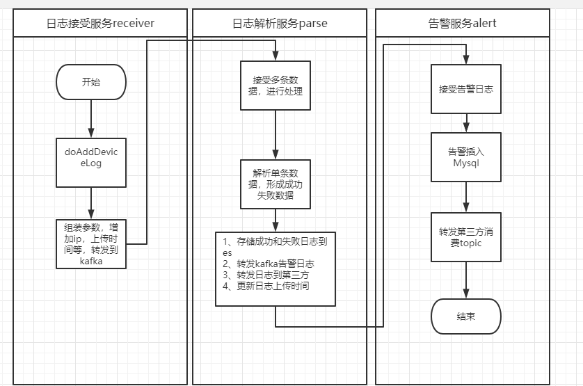
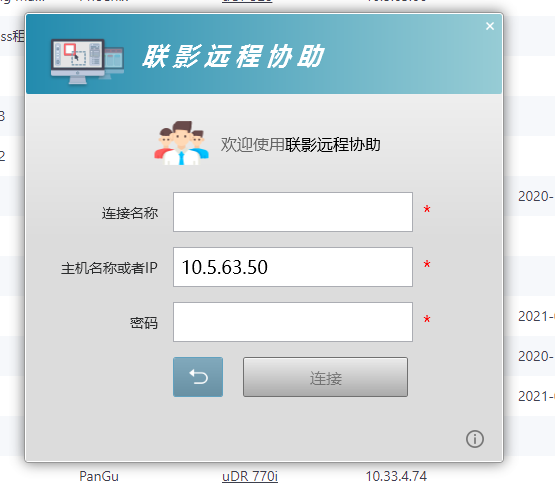

[TOC]

# soalr2ioc相关内容梳理

## 设备日志

## 文件传输

郑和通过/servicelog/GetResourceDataFromSC获取ftp上传基本信息，上传完成后通知solar/servicelog/UpdateOperationResult

## 远程协助

安装Uih RemoteAccess，服务工程师权限下，在【工作台】中添加【远程协助】入口，点击后自动打开RemoteAccess工具，并将该IP传递给RemoteAccess，以便RemoteAccess自动将IP地址填好

## web service

无