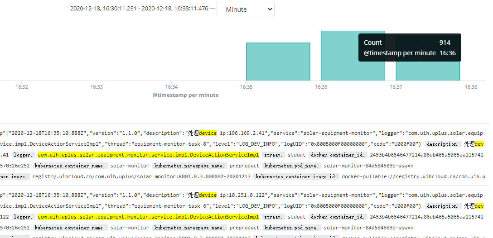
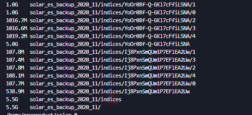
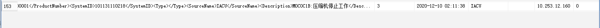
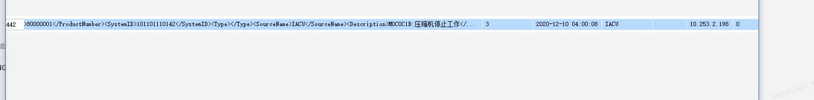
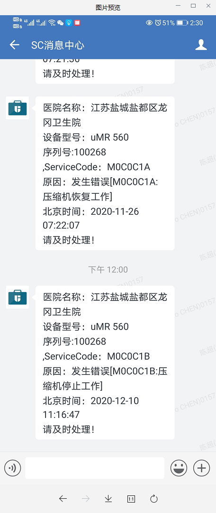
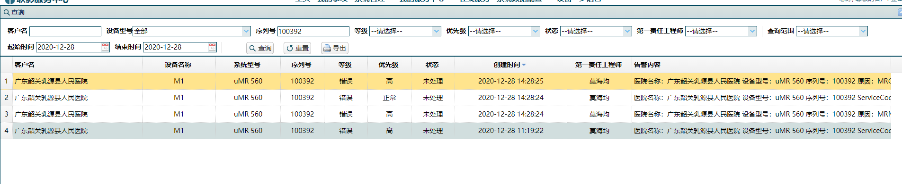
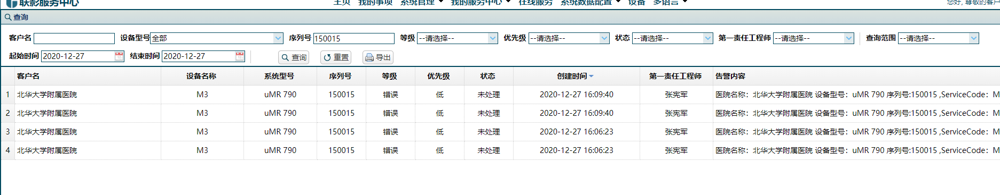

[TOC]


# Solar与SC性能对比

## 1、设备在线检查状态


### Solar设备在线检查状态

在https://kibana.uihcloud.cn/ 上搜索ActionServiceImpl_saveDeviceStatus，发现




```
150s左右 处理device ip
696+914+815=2425台设备
2020-12-18, 16:35:11.234	
2020-12-18, 16:37:46.315
```


### SC设备在线检查状态

查看Task[链接](https://navi.united-imaging.com/UplusTestCollection/UCloud/_workitems/edit/45611)中附件

```
SC:
2020-12-06 16:01:18
2020-12-06 19:30:50,036
~3.5h  2406台 状态
```


## 2、备份、恢复、定时任务清除性能

### Solar 预生产测试

#### 1、备份快照

最近二天数据如下：

```
	backup_snapshot_2020_12_27_23_59_59 backupTask耗时：StopWatch 'backupTask': running time = 17713884584 ns
---------------------------------------------
ns         %     Task name
---------------------------------------------
17713884584  100%  

	backup_snapshot_2020_12_28_23_59_59 backupTask耗时：StopWatch 'backupTask': running time = 28000125560 ns
---------------------------------------------
ns         %     Task name
---------------------------------------------
28000125560  100%  
```

一般数据量

#### 2、备份到obs

二次测试如下（一次数据量比较小，一次数据量大）

TEST1 181M情况


```
 backupToObsTask backupToObs耗时：StopWatch 'backupToObsTask': running time = 50377944967 ns
---------------------------------------------
ns         %     Task name
---------------------------------------------
50377944967  100%  
```


TEST2



```
 backupToObsTask backupToObs耗时：StopWatch 'backupToObsTask': running time = 174428878053 ns
---------------------------------------------
ns         %     Task name
---------------------------------------------
174428878053  100%  
```


### Sc备份、清除

查看task[附件](https://navi.united-imaging.com/UplusTestCollection/UCloud/_workitems/edit/45613)log

```
SC备份和清除：（天）
1530设备数据共耗时【514.9677311】秒---【8.58279551833333】分钟-2020-11-29 03:36:19
```


## 3、告警通知可靠性和实时性


#### 实时性

sc实时性相关截图如下：








```
SC实时性：平均30s左右
```


solar实时性：


```
正常消费kafka未堆积情况大概2s左右
```


#### 可靠性对比

在https://solar.uihcloud.cn/和https://servicecenter.united-imaging.com/上查询数据，进行条数对比。

查询序号为100392，创建日期在2020-12-27




soalr、sc均为4条。

查询序号为100017，创建日期在2020-12-27


soalr、sc均为1条。


查询序号为150015 ，创建日期在2020-12-27




soalr、sc均为4条。

但仍然有部分设备数据没有对上，待跟踪。


