[TOC]


# Soalr性能对比

## 1、设备在线检查状态


### Solar设备在线检查状态

在https://kibana.uihcloud.cn/ 上搜索ActionServiceImpl_saveDeviceStatus，发现


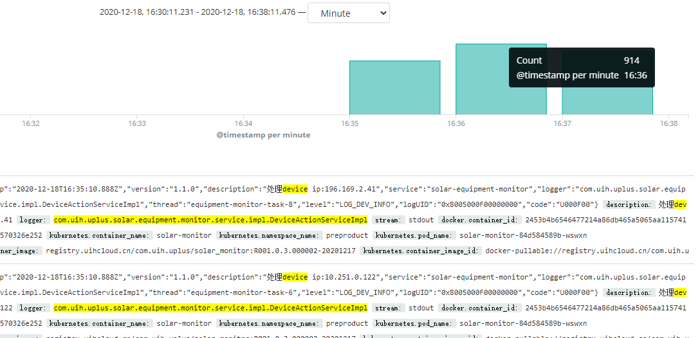

```
150s左右 处理device ip
696+914+815=2425台设备
2020-12-18, 16:35:11.234	
2020-12-18, 16:37:46.315
```


### SC设备在线检查状态

查看Task[链接](https://navi.united-imaging.com/UplusTestCollection/UCloud/_workitems/edit/45611)中附件

```
SC:
2020-12-06 16:01:18
2020-12-06 19:30:50,036
~3.5h  2406台 状态
```


## 2、备份、恢复、定时任务清除性能

### Solar 预生产测试

#### 1、备份快照

最近二天数据如下：

```
	backup_snapshot_2020_12_27_23_59_59 backupTask耗时：StopWatch 'backupTask': running time = 17713884584 ns
---------------------------------------------
ns         %     Task name
---------------------------------------------
17713884584  100%  

	backup_snapshot_2020_12_28_23_59_59 backupTask耗时：StopWatch 'backupTask': running time = 28000125560 ns
---------------------------------------------
ns         %     Task name
---------------------------------------------
28000125560  100%  
```

一般数据量

#### 2、备份到obs

二次测试如下（一次数据量比较小，一次数据量大）

TEST1 181M情况

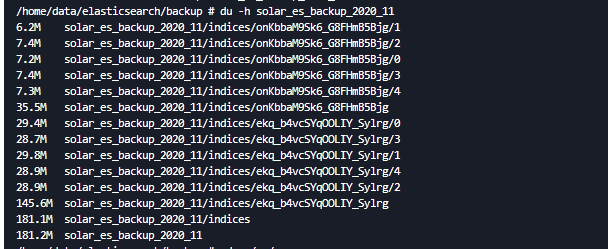

```
 backupToObsTask backupToObs耗时：StopWatch 'backupToObsTask': running time = 50377944967 ns
---------------------------------------------
ns         %     Task name
---------------------------------------------
50377944967  100%  
```


TEST2

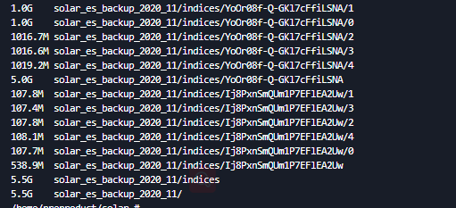

```
 backupToObsTask backupToObs耗时：StopWatch 'backupToObsTask': running time = 174428878053 ns
---------------------------------------------
ns         %     Task name
---------------------------------------------
174428878053  100%  
```

#### 3、删除

| device_log_2020-01      | 78.4Mi/158Mi  | 1.08M |
| ----------------------- | ------------- | ----- |
| device_log_2020-02      | 7.59Mi/15.4Mi | 73.9k |
| device_log_2020-03      | 77.6Mi/156Mi  | 1.04M |
| device_log_2020-04      | 119Mi/248Mi   | 1.74M |
| device_log_2020-05      | 130Mi/260Mi   | 1.90M |
| device_log_2020-06      | 129Mi/254Mi   | 1.89M |
| device_log_2020-07      | 133Mi/268Mi   | 2.00M |
| device_log_2020-08      | 151Mi/296Mi   | 2.40M |
| device_log_2020-09      | 286Mi/571Mi   | 4.86M |
| device_log_2020-10      | 1.26Gi/2.52Gi | 18.7M |
| device_log_2020-11      | 538Mi/1.05Gi  | 8.20M |
| device_log_2020-12      | 2.93Gi/5.85Gi | 39.0M |
| device_log_2021-01      | 627Mi/1.25Gi  | 8.27M |
| dicom_parse_error       | 1.27ki/2.55ki | 0     |
| es_version              | 6.55ki/13.1ki | 1     |
| removedebris            | 2.44Mi/4.86Mi | 6.25k |
| report                  | 1.27ki/2.55ki | 0     |
| service_log_1969-12     | 378ki/786ki   | 288   |
| service_log_1970-01     | 1.93Mi/3.86Mi | 6.25k |
| service_log_2010-10     | 22.7ki/45.5ki | 2     |
| service_log_2013-12     | 12.2ki/24.4ki | 1     |
| service_log_2018-08     | 1.48Mi/3.03Mi | 8.83k |
| service_log_2018-12     | 62.9ki/126ki  | 24    |
| service_log_2019-05     | 330ki/661ki   | 195   |
| service_log_2019-07     | 148ki/295ki   | 15    |
| service_log_2019-08     | 316ki/634ki   | 48    |
| service_log_2019-09     | 336ki/662ki   | 41    |
| service_log_2019-10     | 42.9Mi/85.7Mi | 129k  |
| service_log_2019-11     | 169Mi/337Mi   | 581k  |
| service_log_2019-12     | 174Mi/347Mi   | 606k  |
| service_log_2020-01     | 194Mi/387Mi   | 654k  |
| service_log_2020-02     | 147Mi/293Mi   | 500k  |
| service_log_2020-03     | 211Mi/424Mi   | 726k  |
| service_log_2020-04     | 106Mi/209Mi   | 347k  |
| service_log_2020-05     | 360Mi/699Mi   | 935k  |
| service_log_2020-06     | 389Mi/780Mi   | 1.05M |
| service_log_2020-07     | 50.8Mi/101Mi  | 112k  |
| service_log_2020-08     | 35.9Mi/68.8Mi | 73.1k |
| service_log_2020-09     | 1.32Gi/2.63Gi | 4.09M |
| service_log_2020-10     | 9.25Mi/18.5Mi | 21.6k |
| service_log_2020-11     | 5.01Gi/10.0Gi | 14.9M |
| service_log_2020-12     | 31.6Gi/63.2Gi | 86.9M |
| service_log_2021-01     | 3.22Gi/6.67Gi | 8.27M |
| solar_failed_parsed_log | 33.8Mi/67.6Mi | 31.9k |

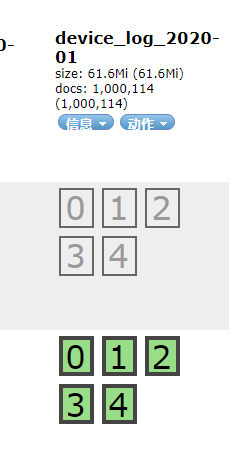

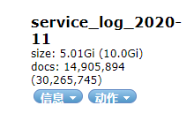


### Sc备份、清除

查看task[附件](https://navi.united-imaging.com/UplusTestCollection/UCloud/_workitems/edit/45613)log

```
SC备份和清除：（天）
1530设备数据共耗时【514.9677311】秒---【8.58279551833333】分钟-2020-11-29 03:36:19
```


## 3、告警通知可靠性和实时性


#### 实时性

sc实时性相关截图如下：

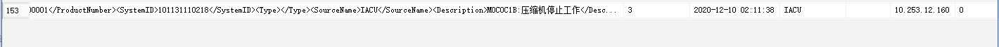

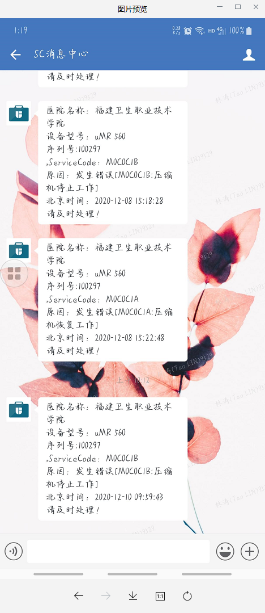

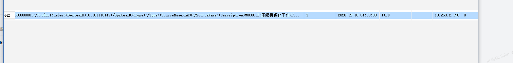

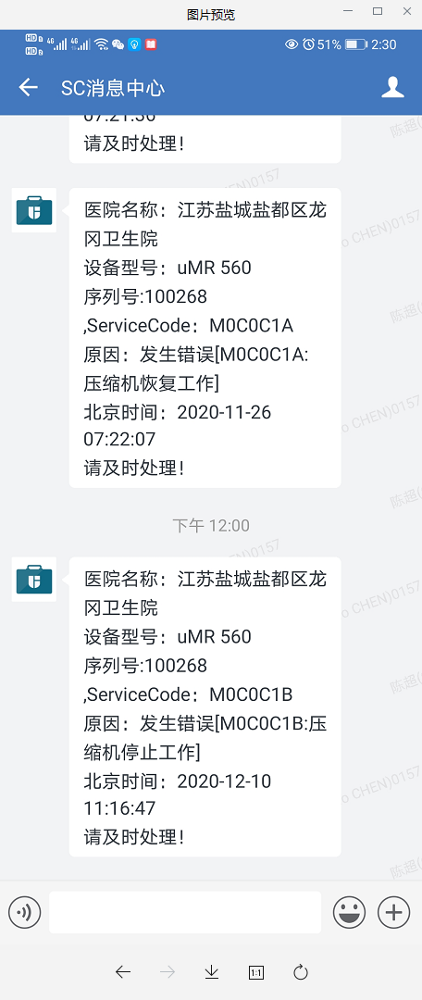

```
SC实时性：平均30s左右
```


solar实时性：

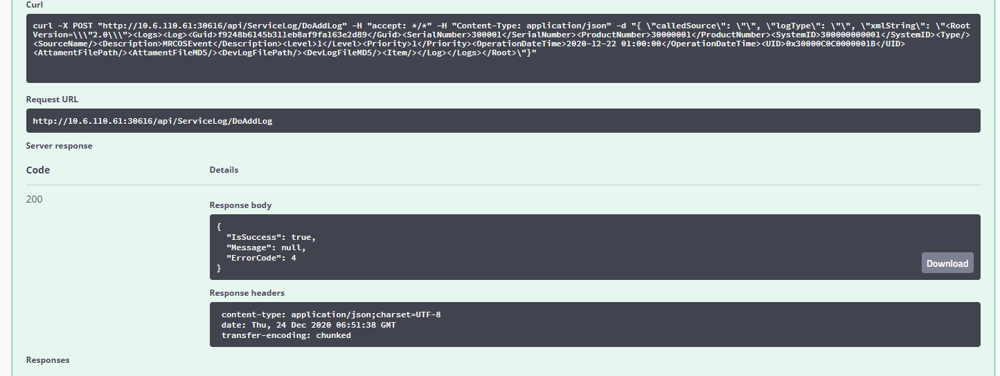

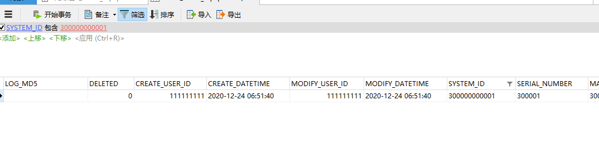

```
正常消费kafka未堆积情况大概2s左右
```


#### 可靠性对比

在https://solar.uihcloud.cn/和https://servicecenter.united-imaging.com/上查询数据，进行条数对比。

查询序号为100392，创建日期在2020-12-27


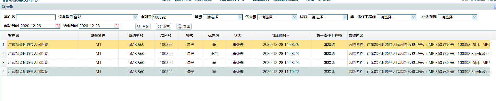

soalr、sc均为4条。

查询序号为100017，创建日期在2020-12-27

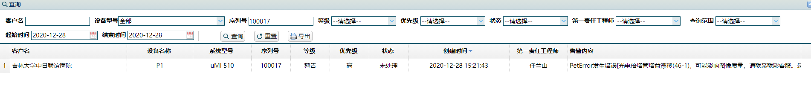

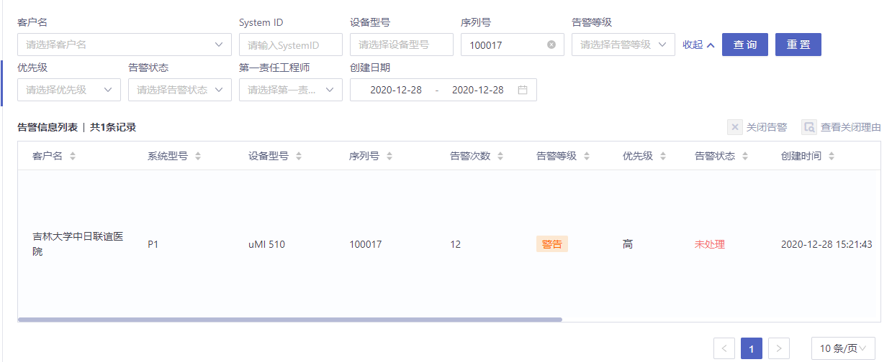

soalr、sc均为1条。


查询序号为150015 ，创建日期在2020-12-27

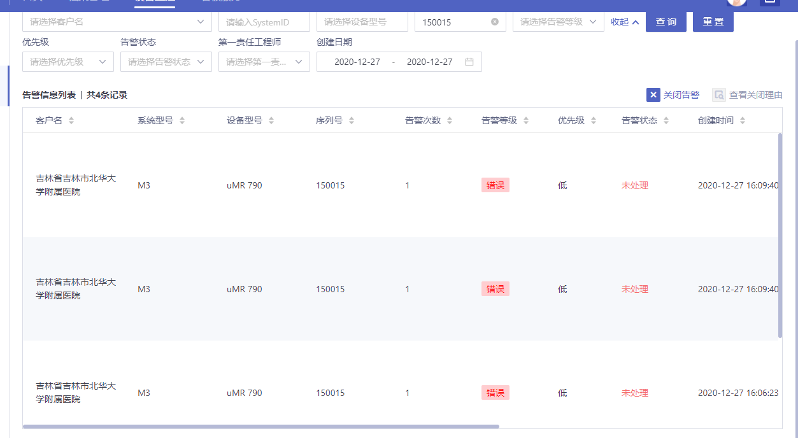


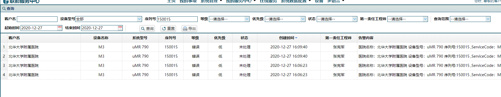

soalr、sc均为4条。


