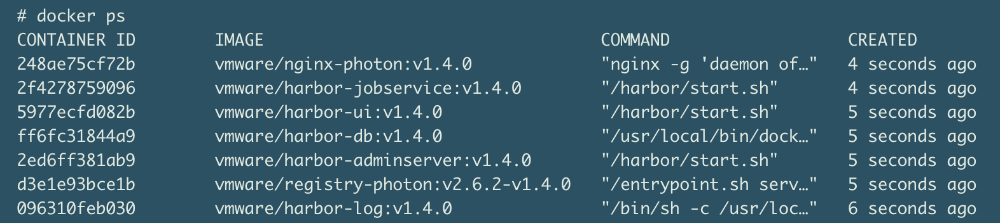
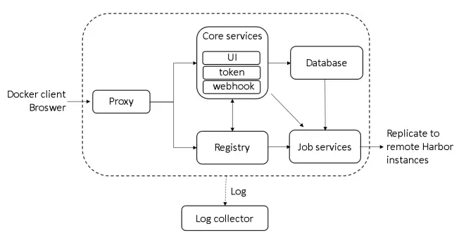

[[_TOC_]]


# 环境安装


## 一、harbor概述

　　VMware开源的企业级Registry项目Harbor，以Docker公司开源的registry 为基础，提供了管理UI, 基于角色的访问控制(Role Based Access Control)，AD/LDAP集成、以及审计日志(Audit logging) 等企业用户需求的功能，同时还原生支持中文，主要特点：

- 基于角色的访问控制 - 用户与 Docker 镜像仓库通过“项目”进行组织管理，一个用户可以对多个镜像仓库在同一命名空间（project）里有不同的权限。
- 镜像复制 - 镜像可以在多个 Registry 实例中复制（同步）。尤其适合于负载均衡，高可用，混合云和多云的场景。
- 图形化用户界面 - 用户可以通过浏览器来浏览，检索当前 Docker 镜像仓库，管理项目和命名空间。
- AD/LDAP 支持 - Harbor 可以集成企业内部已有的 AD/LDAP，用于鉴权认证管理。
- 审计管理 - 所有针对镜像仓库的操作都可以被记录追溯，用于审计管理。
- 国际化 - 已拥有英文、中文、德文、日文和俄文的本地化版本。更多的语言将会添加进来。
- RESTful API - RESTful API 提供给管理员对于 Harbor 更多的操控, 使得与其它管理软件集成变得更容易。
- 部署简单 - 提供在线和离线两种安装工具， 也可以安装到 vSphere 平台(OVA 方式)虚拟设备

## 二、harbor架构介绍

默认情况下，Harbor运行起来后有如下容器：



名称分别为：`nginx`、`harbor-jobservice`、`harbor-ui`、`harbor-db`、`harbor-adminserver`、`registry`以及`harbor-log`。

 

 



如上图所描述，Harbor由6个大的模块所组成：

- **Proxy**: Harbor的registry、UI、token services等组件，都处在一个反向代理后边。该代理将来自浏览器、docker clients的请求转发到后端服务上。
- **Registry**: 负责存储Docker镜像，以及处理Docker push/pull请求。因为Harbor强制要求对镜像的访问做权限控制， 在每一次push/pull请求时，Registry会强制要求客户端从token service那里获得一个有效的token。
- **Core services**: Harbor的核心功能，主要包括如下3个服务:
  1）UI: 作为Registry Webhook, 以图像用户界面的方式辅助用户管理镜像。
  2) `WebHook：WebHook`是在registry中配置的一种机制， 当registry中镜像发生改变时，就可以通知到Harbor的webhook endpoint。Harbor使用webhook来更新日志、初始化同步job等。
  3) T`oken 服务：负责根据用户权限给每个docker push/pull命令签发token. Docker 客户端向Regiøstry服务发起的请求,如果不包含token，会被重定向到这里，获得token后再重新向Registry进行请求`。
-  **`Database`：**为core services提供数据库服务，负责储存用户权限、审计日志、Docker image分组信息等数据。
- **Job services**: 主要用于镜像复制，本地镜像可以被同步到远程Harbor实例上。
- **Log collector**: 负责收集其他组件的日志到一个地方

这里我们与上面运行的7个容器对比，对`harbor-adminserver`感觉有些疑虑。其实这里`harbor-adminserver`主要是作为一个后端的配置数据管理，并没有太多的其他功能。`harbor-ui`所要操作的所有数据都通过harbor-adminserver这样一个数据配置管理中心来完成。

## 三、Harbor实现

Harbor的每一个组件都被包装成一个docker容器。自然，Harbor是通过docker compose来部署的。在[Harbor源代码](https://github.com/vmware/harbor)的make目录下的docker-compose模板会被用于部署Harbor。打开该模板文件，可以看到Harbor由7个容器组件所组成：

- `proxy`: 通过nginx服务器来做反向代理
- `registry`: docker官方发布的一个仓库镜像组件
- `ui`: 整个架构的核心服务。该容器是Harbor工程的主要部分
- `adminserver`: 作为Harbor工程的配置数据管理器使用
- `mysql`: 通过官方Mysql镜像创建的数据库容器
- `job services`: 通过状态机的形式将镜像复制到远程Harbor实例。镜像删除同样也可以被同步到远程Harbor实例中。
- `log`: 运行rsyslogd的容器，主要用于收集其他容器的日志

这些容器之间都通过Docker内的DNS服务发现来连接通信。通过这种方式，每一个容器都可以通过相应的容器来进行访问。对于终端用户来说，只有反向代理(Nginx)服务的端口需要对外暴露。

https://blog.csdn.net/weixin_42082634/article/details/82850298?utm_medium=distribute.pc_relevant.none-task-blog-BlogCommendFromMachineLearnPai2-5.compare&depth_1-utm_source=distribute.pc_relevant.none-task-blog-BlogCommendFromMachineLearnPai2-5.compare


https://www.cnblogs.com/wxwgk/p/13287336.html


https://blog.csdn.net/u010948569/article/details/107222583/

```
   
    [root@centos7 ~]#docker tag 镜像名:标签 私服地址/仓库项目名/镜像名:标签
    
    #推送到私服
    [root@centos7 ~]#docker push  私服地址/仓库项目名/镜像名：标签  
    
    #从私服拉取镜像
    [root@centos7 ~]#docker pull 私服地址/仓库项目名/镜像名：标签
   
   81  docker tag jialinye/test:v1 192.168.74.128/jialinye/test-0804:v1
   82  docker tag jialinye/test:latest 192.168.74.128/jialinye/test-0804:v1
   83  docker images
   84  docker push 192.168.74.128/jialinye/test-0804:v1


```

