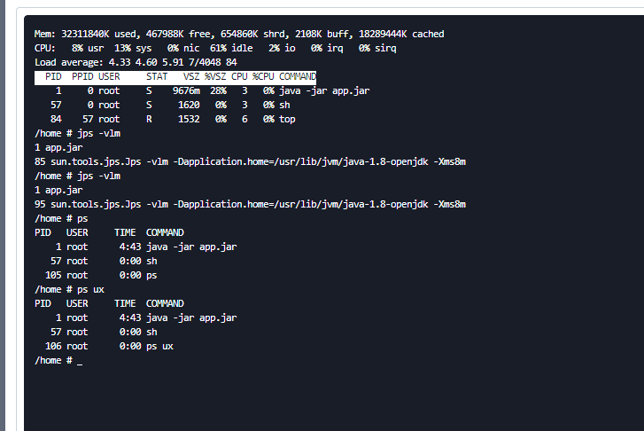
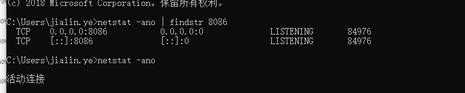

### k8s查看启动命令

### windows下查看端口pid

**Harbor**  → maven仓库

 kubectl get pods -n  dev //pod运行状态**STATUS*

# Kubernetes入门

1. https://www.cnblogs.com/zuoyang/p/9639961.html
2. https://my.oschina.net/u/4381723/blog/4439479

## [CentOS7安装单机kubernetes和Docker](https://www.cnblogs.com/com3/articles/13255342.html)